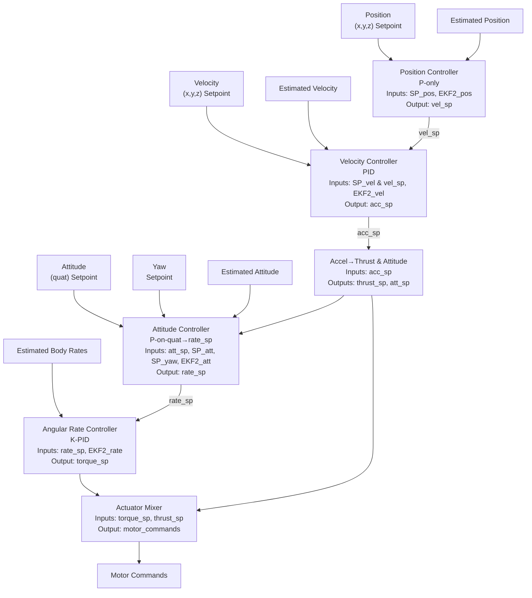

# Quadrotor simulation in Julia

6-DoF quadrotor simulation framework in Julia for testing controllers.

### Prerequisites

- [Docker](https://www.docker.com/products/docker-desktop) installed on your system
- [Visual Studio Code](https://code.visualstudio.com/) with the [Remote - Containers](https://marketplace.visualstudio.com/items?itemName=ms-vscode-remote.remote-containers) extension

### Getting Started

1. Clone the repository
2. Open the project folder in VS Code
3. Select "Remote-Containers: Reopen in Container" from the command palette
4. Once the dev container is running, you can run the simulation with `julia quad_sim.jl`

### System architecture

